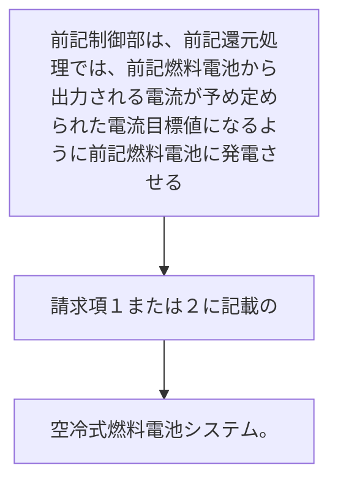

前記制御部は、前記還元処理では、前記燃料電池から出力される電流が予め定められた電流目標値になるように前記燃料電池に発電させる、請求項１または２に記載の空冷式燃料電池システム。

```mermaid
flowchart TD
A[前記制御部は、前記還元処理では、前記燃料電池から出力される電流が予め定められた電流目標値になるように前記燃料電池に発電させる]
B[請求項１または２に記載の]
C[空冷式燃料電池システム。]
A --> B
B --> C
```