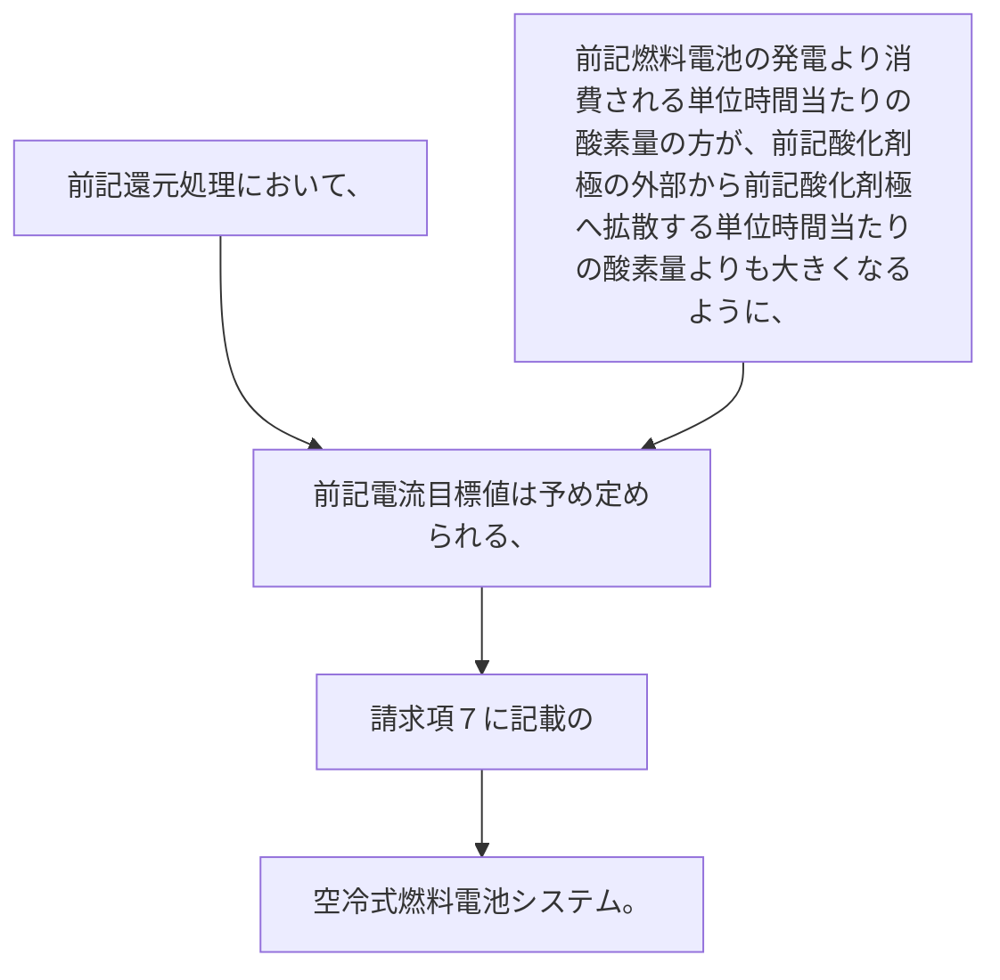

```mermaid
flowchart TD
A[前記還元処理において、]
B[前記燃料電池の発電より消費される単位時間当たりの酸素量の方が、前記酸化剤極の外部から前記酸化剤極へ拡散する単位時間当たりの酸素量よりも大きくなるように、]
C[前記電流目標値は予め定められる、]
D[請求項７に記載の]
E[空冷式燃料電池システム。]

A --> C
B --> C
C --> D
D --> E
```