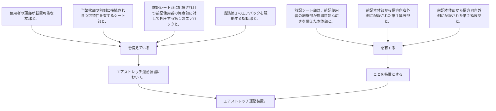

```mermaid
flowchart TD
A[使用者の頭部が載置可能な枕部と、]
B[当該枕部の前側に接続され且つ可撓性を有するシート部と、]
C[前記シート部に配設され且つ前記使用者の施療部に対して押圧する第１のエアバックと、]
D[当該第１のエアバックを駆動する駆動部と、]
E[を備えている]
F[エアストレッチ運動装置において、]
G[前記シート部は、前記使用者の施療部が載置可能な広さを備えた本体部と、]
H[前記本体部から幅方向右外側に配設された第１延設部と、]
I[前記本体部から幅方向左外側に配設された第２延設部と、]
J[を有する]
K[ことを特徴とする]
L[エアストレッチ運動装置。]
A --> E
B --> E
C --> E
D --> E
E --> F
F --> L
G --> J
H --> J
I --> J
J --> K
K --> L
```