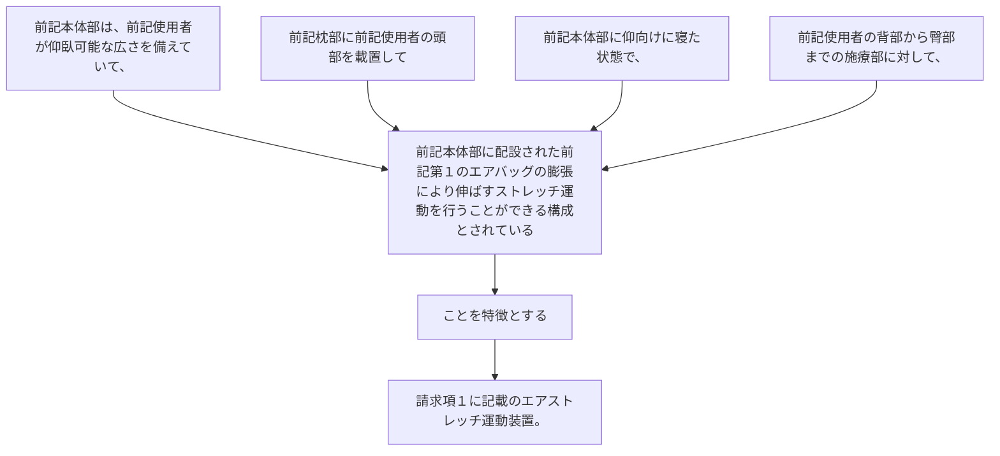

```mermaid
flowchart TD
A[前記本体部は、前記使用者が仰臥可能な広さを備えていて、]
B[前記枕部に前記使用者の頭部を載置して]
C[前記本体部に仰向けに寝た状態で、]
D[前記使用者の背部から臀部までの施療部に対して、]
E[前記本体部に配設された前記第１のエアバッグの膨張により伸ばすストレッチ運動を行うことができる構成とされている]
F[ことを特徴とする]
G[請求項１に記載のエアストレッチ運動装置。]
A --> E
B --> E
C --> E
D --> E
E --> F
F --> G
```