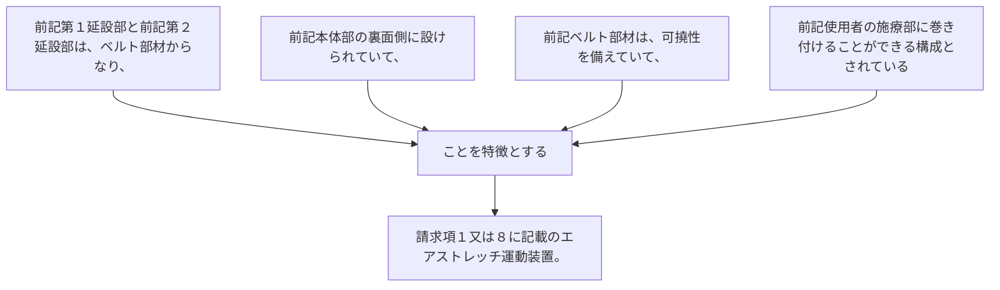

```mermaid
flowchart TD
A[前記第１延設部と前記第２延設部は、ベルト部材からなり、]
B[前記本体部の裏面側に設けられていて、]
C[前記ベルト部材は、可撓性を備えていて、]
D[前記使用者の施療部に巻き付けることができる構成とされている]
E[ことを特徴とする]
F[請求項１又は８に記載のエアストレッチ運動装置。]
A --> E
B --> E
C --> E
D --> E
E --> F
```