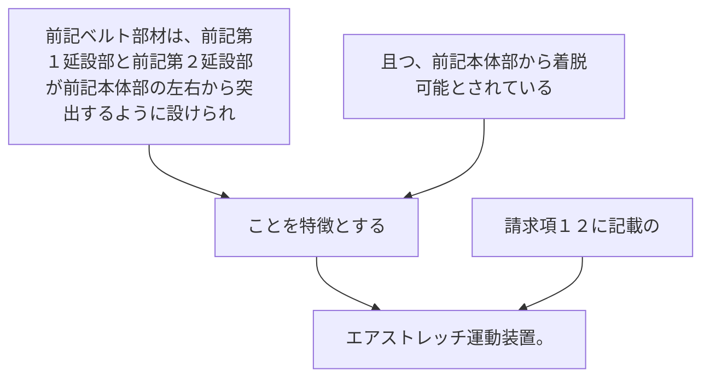

前記ベルト部材は、前記第１延設部と前記第２延設部が前記本体部の左右から突出するように設けられ且つ、前記本体部から着脱可能とされている
ことを特徴とする請求項１２に記載のエアストレッチ運動装置。

```mermaid
flowchart TD
A[前記ベルト部材は、前記第１延設部と前記第２延設部が前記本体部の左右から突出するように設けられ]
B[且つ、前記本体部から着脱可能とされている]
C[ことを特徴とする]
D[請求項１２に記載の]
E[エアストレッチ運動装置。]
A --> C
B --> C
C --> E
D --> E
```