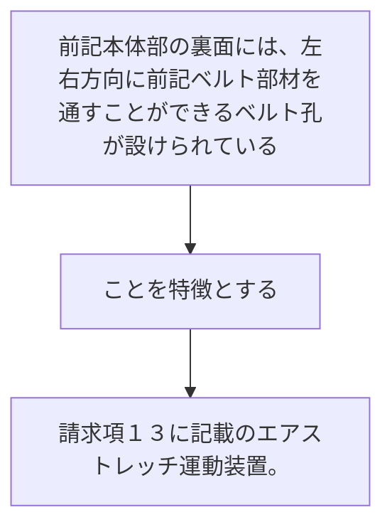

前記本体部の裏面には、左右方向に前記ベルト部材を通すことができるベルト孔が設けられている
ことを特徴とする請求項１３に記載のエアストレッチ運動装置。

```mermaid
flowchart TD
A[前記本体部の裏面には、左右方向に前記ベルト部材を通すことができるベルト孔が設けられている]
B[ことを特徴とする]
C[請求項１３に記載のエアストレッチ運動装置。]
A --> B
B --> C
```