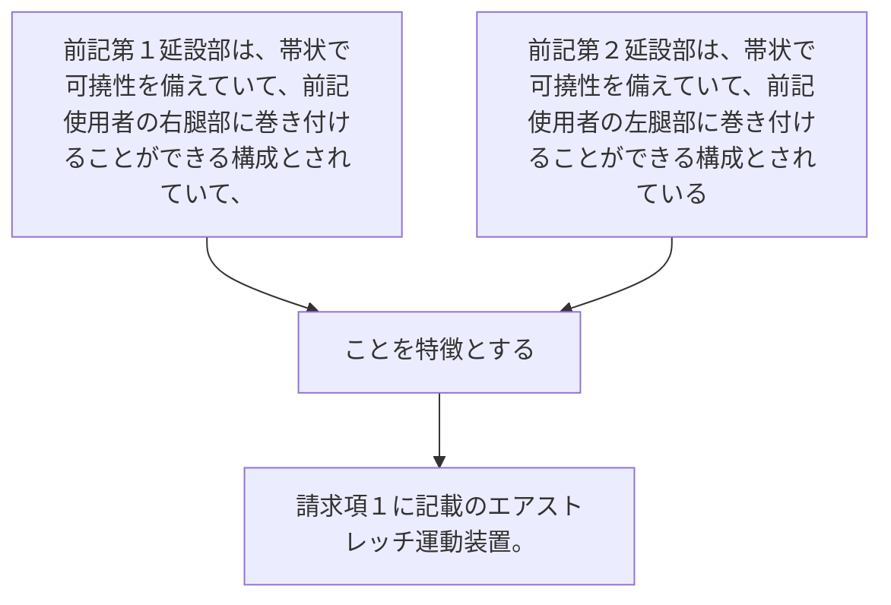

```mermaid
flowchart TD
A[前記第１延設部は、帯状で可撓性を備えていて、前記使用者の右腿部に巻き付けることができる構成とされていて、]
B[前記第２延設部は、帯状で可撓性を備えていて、前記使用者の左腿部に巻き付けることができる構成とされている]
C[ことを特徴とする]
D[請求項１に記載のエアストレッチ運動装置。]
A --> C
B --> C
C --> D
```