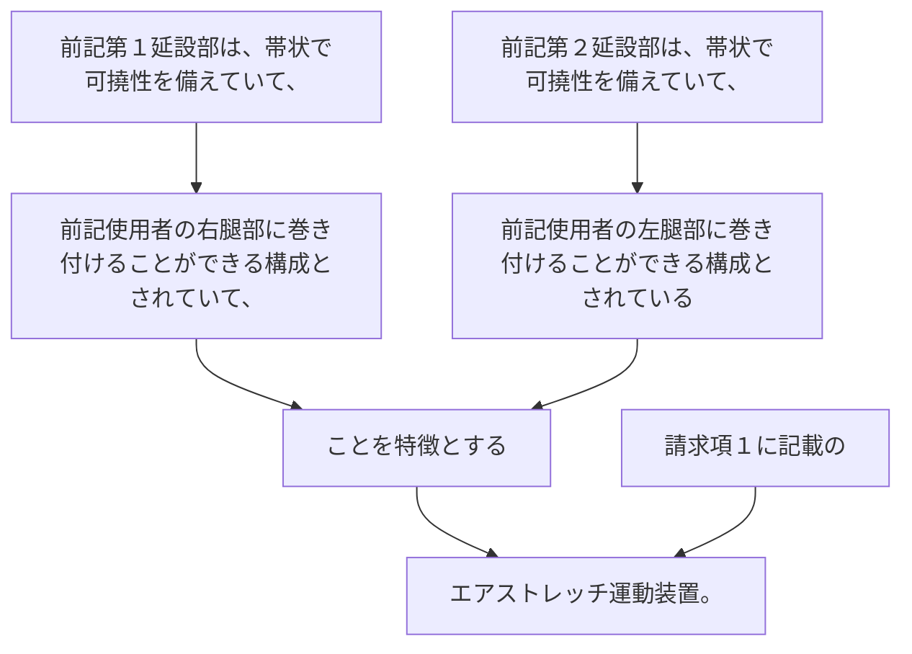

```mermaid
flowchart TD
A[前記第１延設部は、帯状で可撓性を備えていて、]
B[前記使用者の右腿部に巻き付けることができる構成とされていて、]
C[前記第２延設部は、帯状で可撓性を備えていて、]
D[前記使用者の左腿部に巻き付けることができる構成とされている]
E[ことを特徴とする]
F[請求項１に記載の]
G[エアストレッチ運動装置。]
A --> B
B --> E
C --> D
D --> E
E --> G
F --> G
```