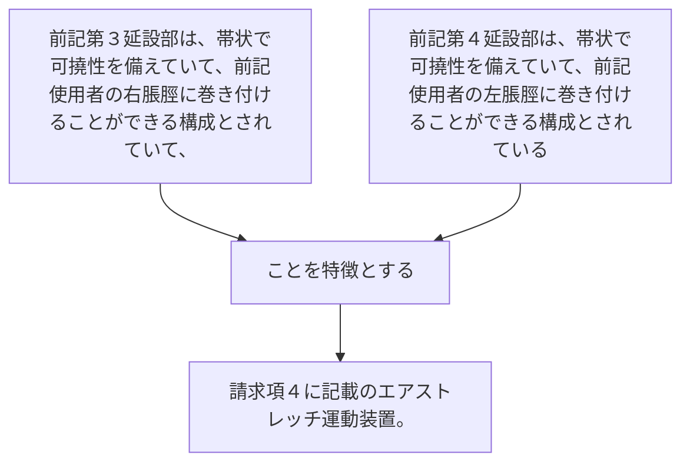

前記第３延設部は、帯状で可撓性を備えていて、前記使用者の右脹脛に巻き付けることができる構成とされていて、
前記第４延設部は、帯状で可撓性を備えていて、前記使用者の左脹脛に巻き付けることができる構成とされている
ことを特徴とする請求項４に記載のエアストレッチ運動装置。

```mermaid
flowchart TD
A[前記第３延設部は、帯状で可撓性を備えていて、前記使用者の右脹脛に巻き付けることができる構成とされていて、]
B[前記第４延設部は、帯状で可撓性を備えていて、前記使用者の左脹脛に巻き付けることができる構成とされている]
C[ことを特徴とする]
D[請求項４に記載のエアストレッチ運動装置。]
A --> C
B --> C
C --> D
```