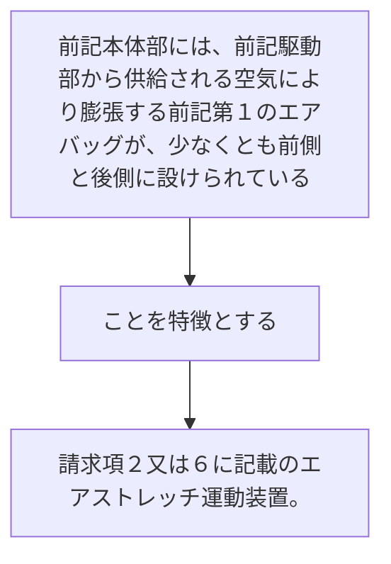

前記本体部には、前記駆動部から供給される空気により膨張する前記第１のエアバッグが、少なくとも前側と後側に設けられている
ことを特徴とする請求項２又は６に記載のエアストレッチ運動装置。

```mermaid
flowchart TD
A[前記本体部には、前記駆動部から供給される空気により膨張する前記第１のエアバッグが、少なくとも前側と後側に設けられている]
B[ことを特徴とする]
C[請求項２又は６に記載のエアストレッチ運動装置。]
A --> B
B --> C
```