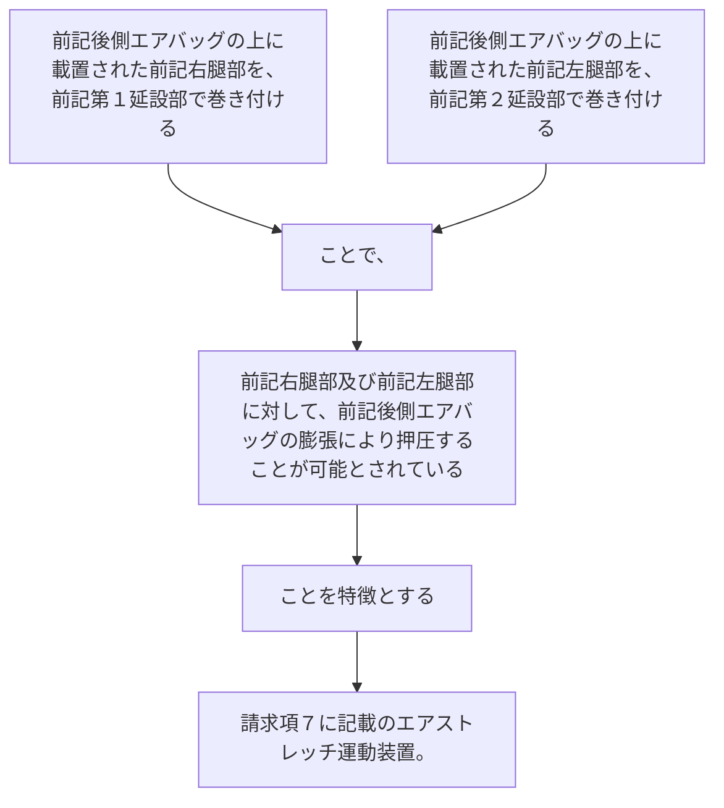

```mermaid
flowchart TD
A[前記後側エアバッグの上に載置された前記右腿部を、前記第１延設部で巻き付ける]
B[前記後側エアバッグの上に載置された前記左腿部を、前記第２延設部で巻き付ける]
C[ことで、]
D[前記右腿部及び前記左腿部に対して、前記後側エアバッグの膨張により押圧することが可能とされている]
E[ことを特徴とする]
F[請求項７に記載のエアストレッチ運動装置。]
A --> C
B --> C
C --> D
D --> E
E --> F
```