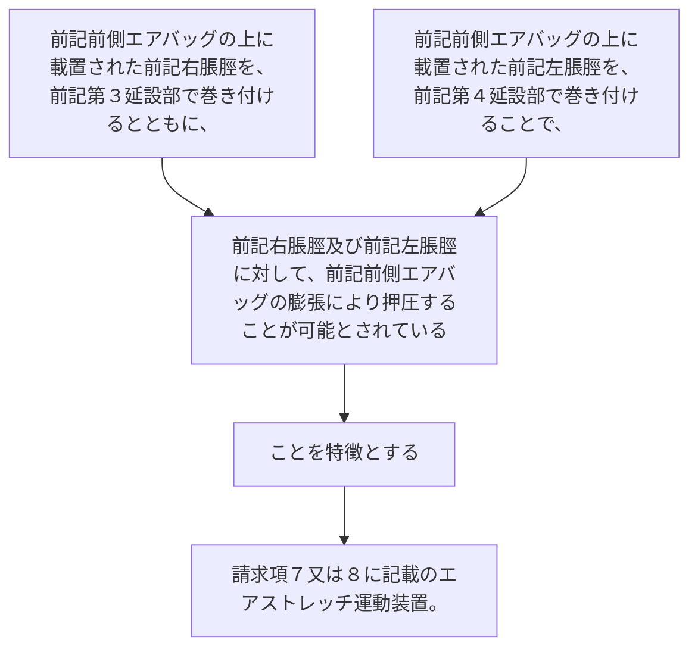

```mermaid
flowchart TD
A[前記前側エアバッグの上に載置された前記右脹脛を、前記第３延設部で巻き付けるとともに、]
B[前記前側エアバッグの上に載置された前記左脹脛を、前記第４延設部で巻き付けることで、]
C[前記右脹脛及び前記左脹脛に対して、前記前側エアバッグの膨張により押圧することが可能とされている]
D[ことを特徴とする]
E[請求項７又は８に記載のエアストレッチ運動装置。]
A --> C
B --> C
C --> D
D --> E
```