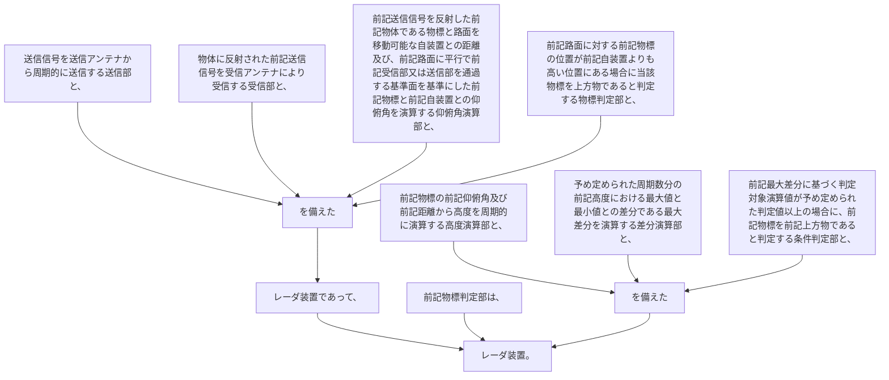

```mermaid
flowchart TD
A[送信信号を送信アンテナから周期的に送信する送信部と、]
B[物体に反射された前記送信信号を受信アンテナにより受信する受信部と、]
C[前記送信信号を反射した前記物体である物標と路面を移動可能な自装置との距離及び、前記路面に平行で前記受信部又は送信部を通過する基準面を基準にした前記物標と前記自装置との仰俯角を演算する仰俯角演算部と、]
D[前記路面に対する前記物標の位置が前記自装置よりも高い位置にある場合に当該物標を上方物であると判定する物標判定部と、]
E[を備えた]
F[レーダ装置であって、]
G[前記物標判定部は、]
H[前記物標の前記仰俯角及び前記距離から高度を周期的に演算する高度演算部と、]
I[予め定められた周期数分の前記高度における最大値と最小値との差分である最大差分を演算する差分演算部と、]
J[前記最大差分に基づく判定対象演算値が予め定められた判定値以上の場合に、前記物標を前記上方物であると判定する条件判定部と、]
K[を備えた]
L[レーダ装置。]
A --> E
B --> E
C --> E
D --> E
E --> F
F --> L
G --> L
H --> K
I --> K
J --> K
K --> L
```