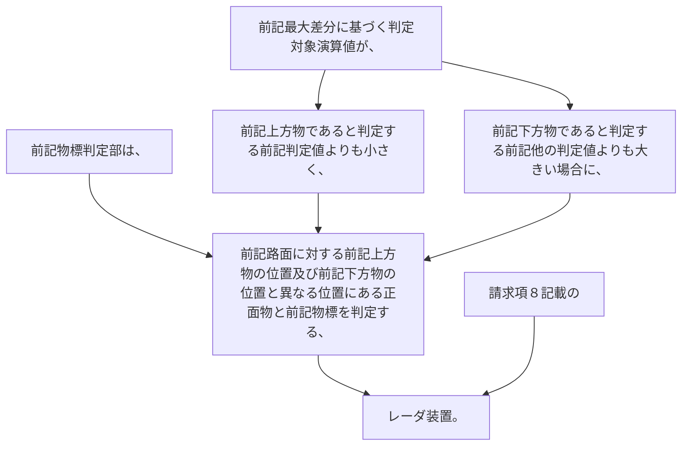

```mermaid
flowchart TD
A[前記物標判定部は、]
B[前記最大差分に基づく判定対象演算値が、]
C[前記上方物であると判定する前記判定値よりも小さく、]
D[前記下方物であると判定する前記他の判定値よりも大きい場合に、]
E[前記路面に対する前記上方物の位置及び前記下方物の位置と異なる位置にある正面物と前記物標を判定する、]
F[請求項８記載の]
G[レーダ装置。]

A --> E
B --> C
B --> D
C --> E
D --> E
E --> G
F --> G
```