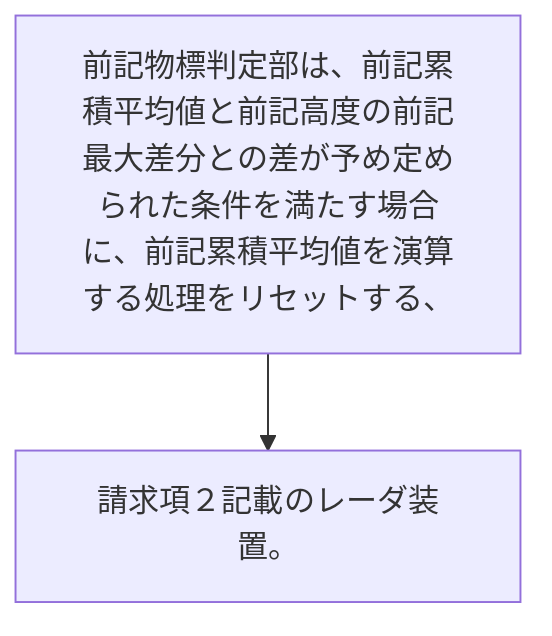

前記物標判定部は、前記累積平均値と前記高度の前記最大差分との差が予め定められた条件を満たす場合に、前記累積平均値を演算する処理をリセットする、
請求項２記載のレーダ装置。

```mermaid
flowchart TD
A[前記物標判定部は、前記累積平均値と前記高度の前記最大差分との差が予め定められた条件を満たす場合に、前記累積平均値を演算する処理をリセットする、]
B[請求項２記載のレーダ装置。]
A --> B
```