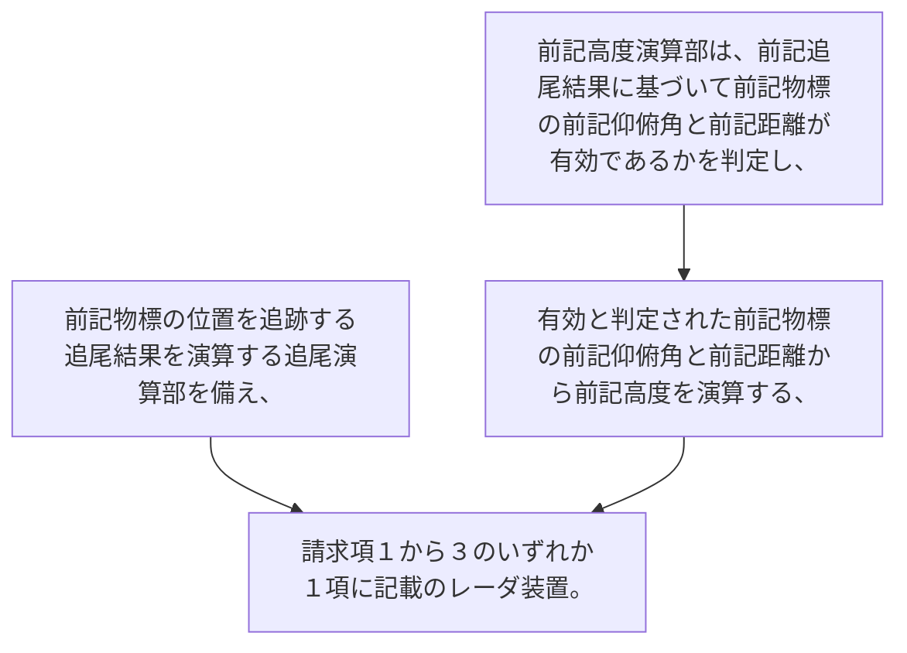

前記物標の位置を追跡する追尾結果を演算する追尾演算部を備え、
前記高度演算部は、前記追尾結果に基づいて前記物標の前記仰俯角と前記距離が有効であるかを判定し、有効と判定された前記物標の前記仰俯角と前記距離から前記高度を演算する、
請求項１から３のいずれか１項に記載のレーダ装置。

```mermaid
flowchart TD
A[前記物標の位置を追跡する追尾結果を演算する追尾演算部を備え、]
B[前記高度演算部は、前記追尾結果に基づいて前記物標の前記仰俯角と前記距離が有効であるかを判定し、]
C[有効と判定された前記物標の前記仰俯角と前記距離から前記高度を演算する、]
D[請求項１から３のいずれか１項に記載のレーダ装置。]
A --> D
B --> C
C --> D
```