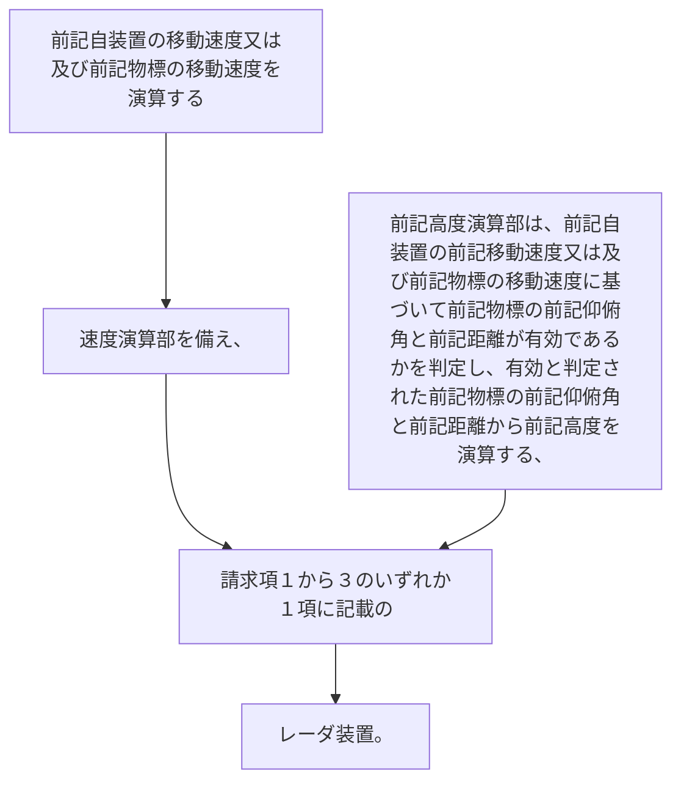

```mermaid
flowchart TD
A[前記自装置の移動速度又は及び前記物標の移動速度を演算する]
B[速度演算部を備え、]
C[前記高度演算部は、前記自装置の前記移動速度又は及び前記物標の移動速度に基づいて前記物標の前記仰俯角と前記距離が有効であるかを判定し、有効と判定された前記物標の前記仰俯角と前記距離から前記高度を演算する、]
D[請求項１から３のいずれか１項に記載の]
E[レーダ装置。]
A --> B
B --> D
C --> D
D --> E
```