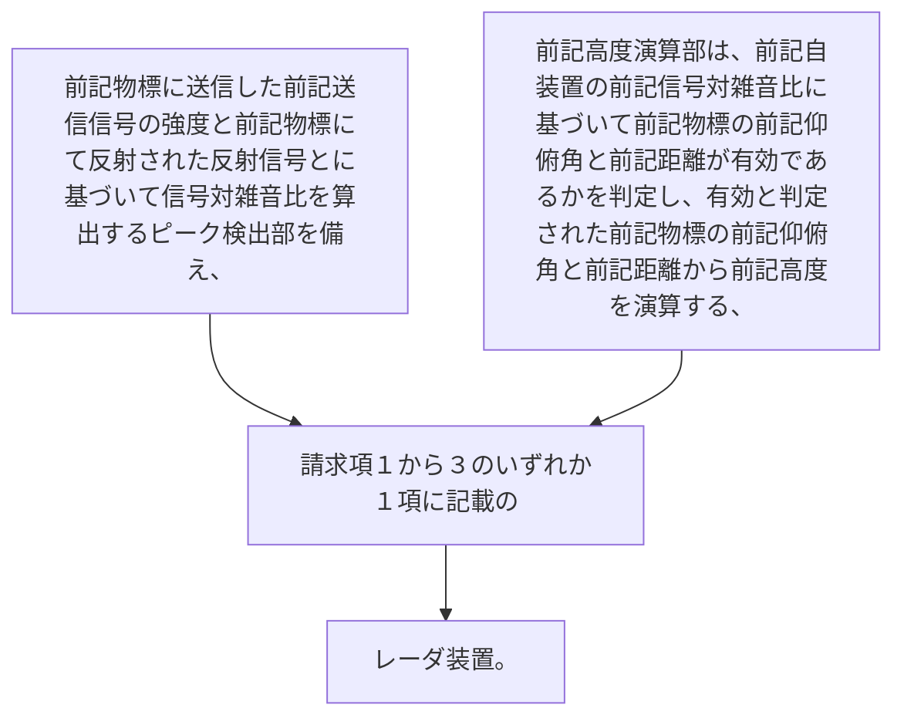

```mermaid
flowchart TD
A[前記物標に送信した前記送信信号の強度と前記物標にて反射された反射信号とに基づいて信号対雑音比を算出するピーク検出部を備え、]
B[前記高度演算部は、前記自装置の前記信号対雑音比に基づいて前記物標の前記仰俯角と前記距離が有効であるかを判定し、有効と判定された前記物標の前記仰俯角と前記距離から前記高度を演算する、]
C[請求項１から３のいずれか１項に記載の]
D[レーダ装置。]
A --> C
B --> C
C --> D
```