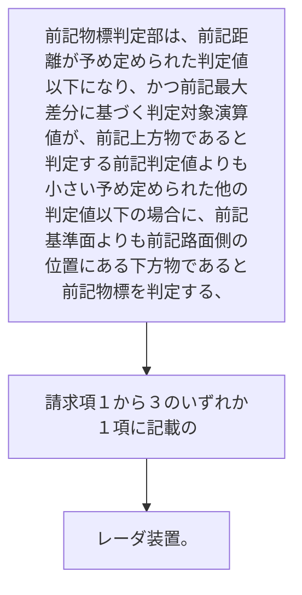

```mermaid
flowchart TD
A[前記物標判定部は、前記距離が予め定められた判定値以下になり、かつ前記最大差分に基づく判定対象演算値が、前記上方物であると判定する前記判定値よりも小さい予め定められた他の判定値以下の場合に、前記基準面よりも前記路面側の位置にある下方物であると前記物標を判定する、]
B[請求項１から３のいずれか１項に記載の]
C[レーダ装置。]
A --> B
B --> C
```