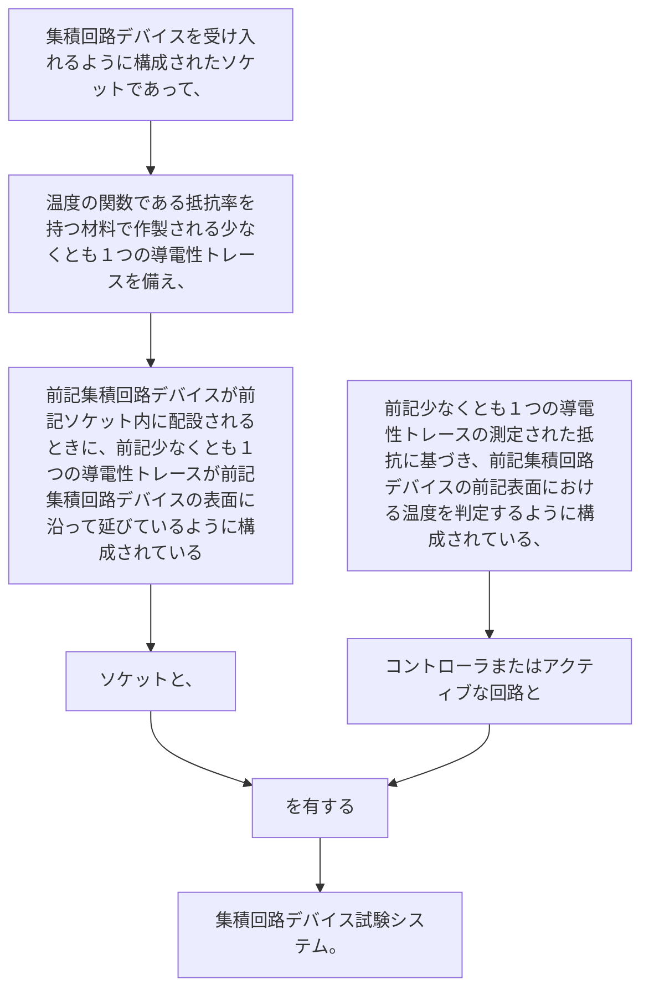

```mermaid
flowchart TD
A[集積回路デバイスを受け入れるように構成されたソケットであって、]
B[温度の関数である抵抗率を持つ材料で作製される少なくとも１つの導電性トレースを備え、]
C[前記集積回路デバイスが前記ソケット内に配設されるときに、前記少なくとも１つの導電性トレースが前記集積回路デバイスの表面に沿って延びているように構成されている]
D[ソケットと、]
E[前記少なくとも１つの導電性トレースの測定された抵抗に基づき、前記集積回路デバイスの前記表面における温度を判定するように構成されている、]
F[コントローラまたはアクティブな回路と]
G[を有する]
H[集積回路デバイス試験システム。]

A --> B
B --> C
C --> D
E --> F
D --> G
F --> G
G --> H
```