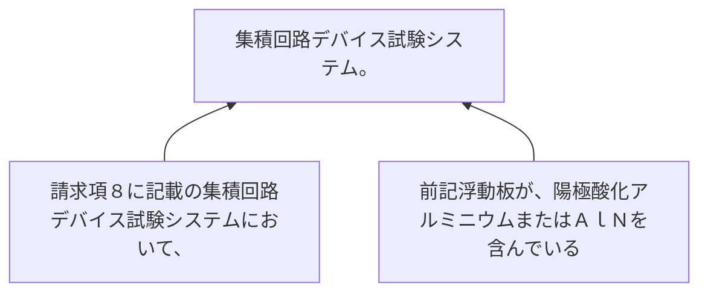

請求項８に記載の集積回路デバイス試験システムにおいて、
前記浮動板が、陽極酸化アルミニウムまたはＡｌＮを含んでいる集積回路デバイス試験システム。

```mermaid
flowchart BT
C[集積回路デバイス試験システム。]
A[請求項８に記載の集積回路デバイス試験システムにおいて、]
B[前記浮動板が、陽極酸化アルミニウムまたはＡｌＮを含んでいる]
A --> C
B --> C
```