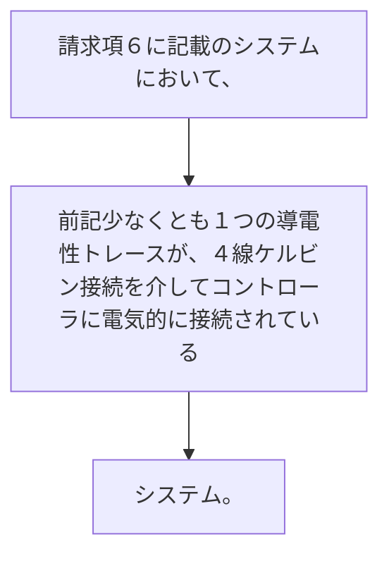

請求項６に記載のシステムにおいて、
前記少なくとも１つの導電性トレースが、４線ケルビン接続を介してコントローラに電気的に接続されているシステム。

```mermaid
flowchart TD
A[請求項６に記載のシステムにおいて、]
B[前記少なくとも１つの導電性トレースが、４線ケルビン接続を介してコントローラに電気的に接続されている]
C[システム。]
A --> B
B --> C
```