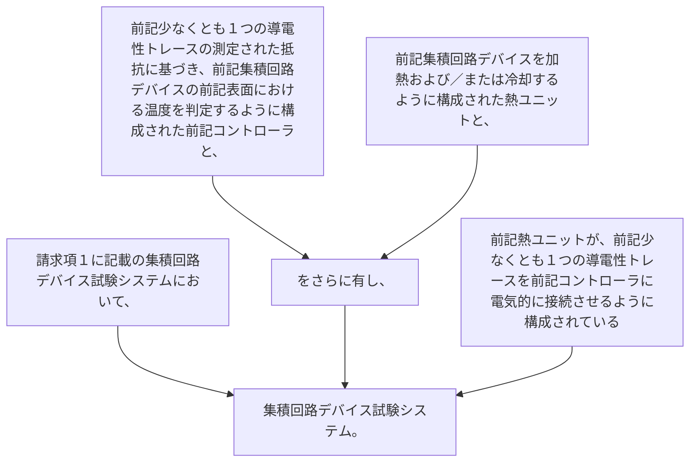

```mermaid
flowchart TD
A[請求項１に記載の集積回路デバイス試験システムにおいて、]
B[前記少なくとも１つの導電性トレースの測定された抵抗に基づき、前記集積回路デバイスの前記表面における温度を判定するように構成された前記コントローラと、]
C[前記集積回路デバイスを加熱および／または冷却するように構成された熱ユニットと、]
D[をさらに有し、]
E[前記熱ユニットが、前記少なくとも１つの導電性トレースを前記コントローラに電気的に接続させるように構成されている]
F[集積回路デバイス試験システム。]
A --> F
B --> D
C --> D
D --> F
E --> F
```