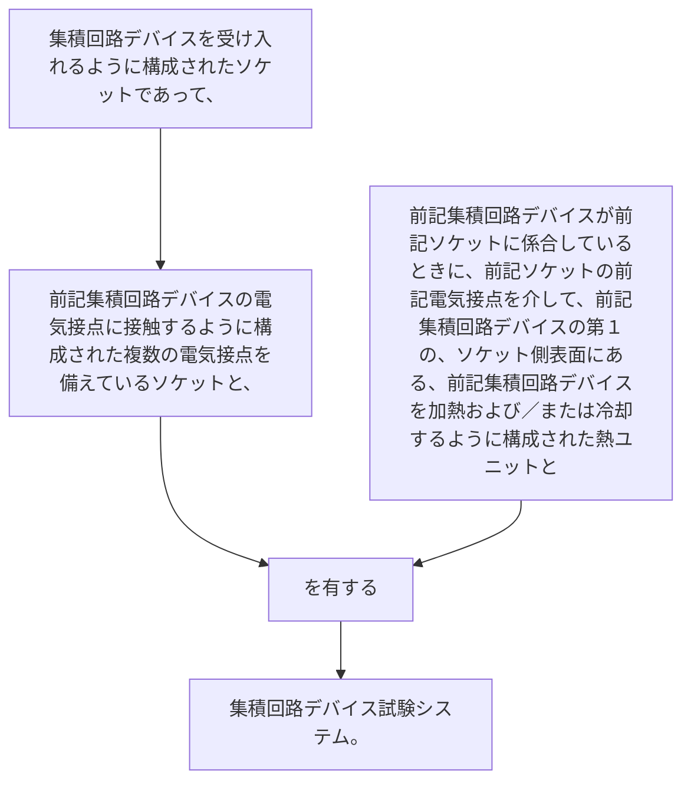

集積回路デバイスを受け入れるように構成されたソケットであって、前記集積回路デバイスの電気接点に接触するように構成された複数の電気接点を備えているソケットと、
前記集積回路デバイスが前記ソケットに係合しているときに、前記ソケットの前記電気接点を介して、前記集積回路デバイスの第１の、ソケット側表面にある、前記集積回路デバイスを加熱および／または冷却するように構成された熱ユニットとを有する集積回路デバイス試験システム。
