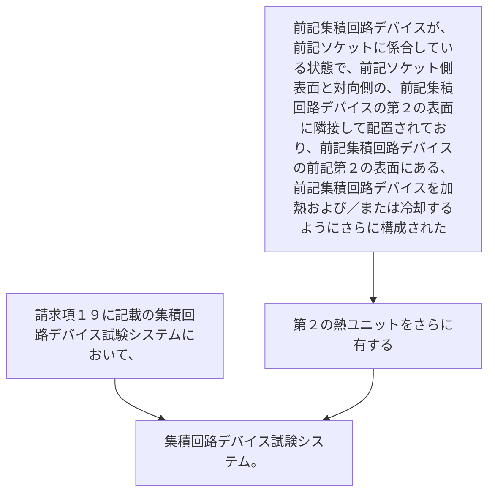

```mermaid
flowchart TD
A[請求項１９に記載の集積回路デバイス試験システムにおいて、]
B[前記集積回路デバイスが、前記ソケットに係合している状態で、前記ソケット側表面と対向側の、前記集積回路デバイスの第２の表面に隣接して配置されており、前記集積回路デバイスの前記第２の表面にある、前記集積回路デバイスを加熱および／または冷却するようにさらに構成された]
C[第２の熱ユニットをさらに有する]
D[集積回路デバイス試験システム。]

A --> D
B --> C
C --> D
```