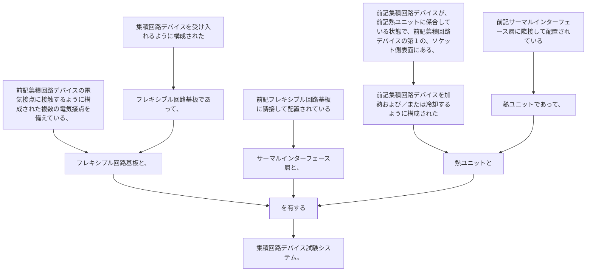

集積回路デバイスを受け入れるように構成されたフレキシブル回路基板であって、前記集積回路デバイスの電気接点に接触するように構成された複数の電気接点を備えている、フレキシブル回路基板と、
前記フレキシブル回路基板に隣接して配置されているサーマルインターフェース層と、
前記サーマルインターフェース層に隣接して配置されている熱ユニットであって、前記集積回路デバイスが、前記熱ユニットに係合している状態で、前記集積回路デバイスの第１の、ソケット側表面にある、前記集積回路デバイスを加熱および／または冷却するように構成された熱ユニットとを有する集積回路デバイス試験システム。
