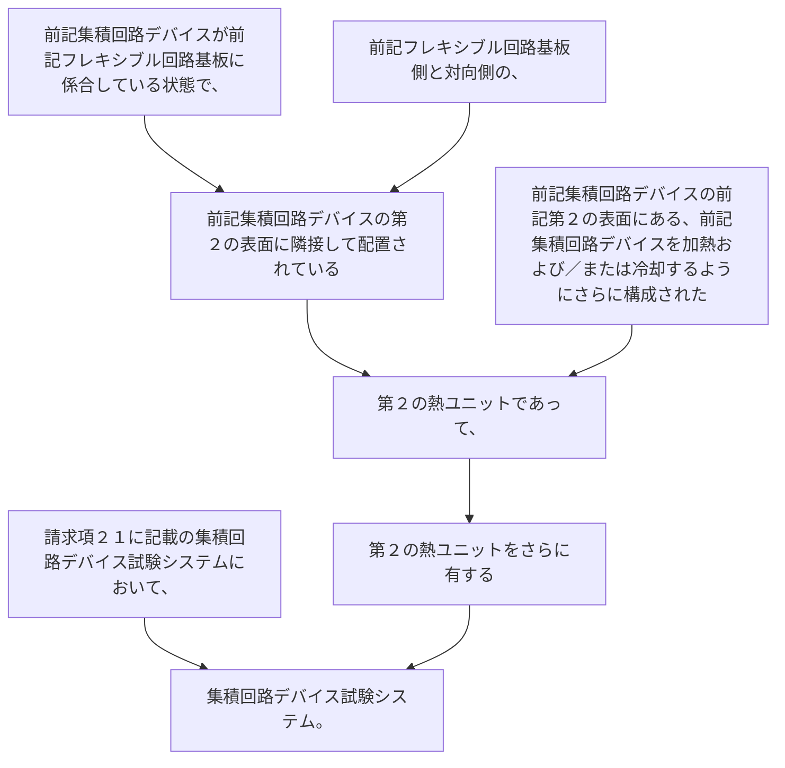

請求項２１に記載の集積回路デバイス試験システムにおいて、
前記集積回路デバイスが前記フレキシブル回路基板に係合している状態で、前記フレキシブル回路基板側と対向側の、前記集積回路デバイスの第２の表面に隣接して配置されている第２の熱ユニットであって、前記集積回路デバイスの前記第２の表面にある、前記集積回路デバイスを加熱および／または冷却するようにさらに構成された第２の熱ユニットをさらに有する集積回路デバイス試験システム。
