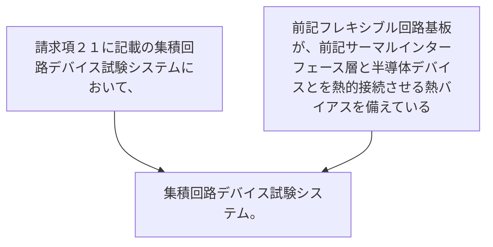

請求項２１に記載の集積回路デバイス試験システムにおいて、
前記フレキシブル回路基板が、前記サーマルインターフェース層と半導体デバイスとを熱的接続させる熱バイアスを備えている集積回路デバイス試験システム。

```mermaid
flowchart TD
A[請求項２１に記載の集積回路デバイス試験システムにおいて、]
B[前記フレキシブル回路基板が、前記サーマルインターフェース層と半導体デバイスとを熱的接続させる熱バイアスを備えている]
C[集積回路デバイス試験システム。]
A --> C
B --> C
```