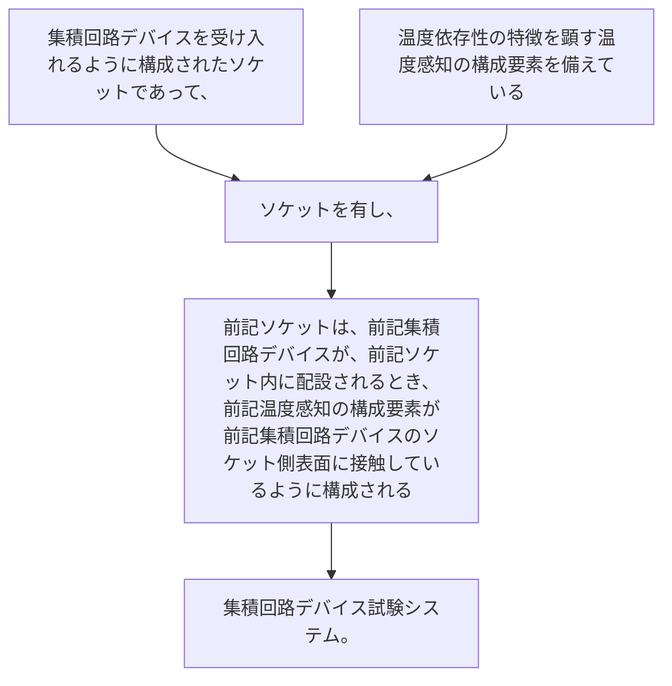

```mermaid
flowchart TD
A[集積回路デバイスを受け入れるように構成されたソケットであって、]
B[温度依存性の特徴を顕す温度感知の構成要素を備えている]
C[ソケットを有し、]
D[前記ソケットは、前記集積回路デバイスが、前記ソケット内に配設されるとき、前記温度感知の構成要素が前記集積回路デバイスのソケット側表面に接触しているように構成される]
E[集積回路デバイス試験システム。]
A --> C
B --> C
C --> D
D --> E
```