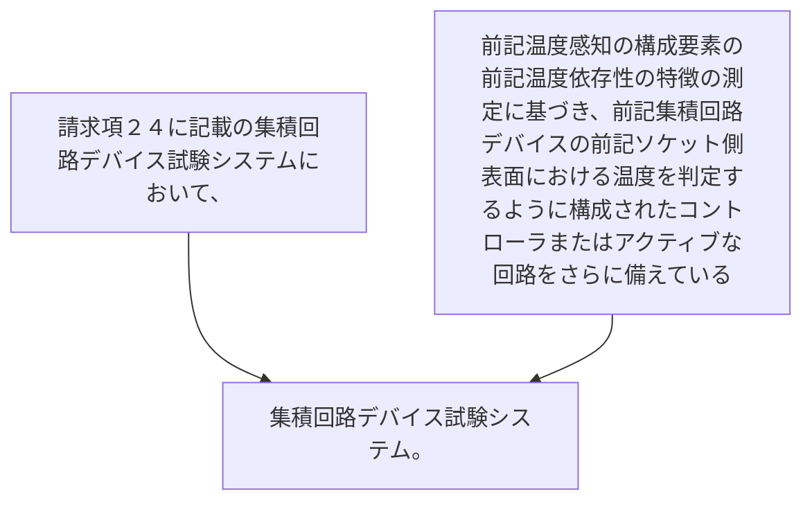

請求項２４に記載の集積回路デバイス試験システムにおいて、
前記温度感知の構成要素の前記温度依存性の特徴の測定に基づき、前記集積回路デバイスの前記ソケット側表面における温度を判定するように構成されたコントローラまたはアクティブな回路をさらに備えている集積回路デバイス試験システム。

```mermaid
flowchart TD
A[請求項２４に記載の集積回路デバイス試験システムにおいて、]
B[前記温度感知の構成要素の前記温度依存性の特徴の測定に基づき、前記集積回路デバイスの前記ソケット側表面における温度を判定するように構成されたコントローラまたはアクティブな回路をさらに備えている]
C[集積回路デバイス試験システム。]
A --> C
B --> C
```