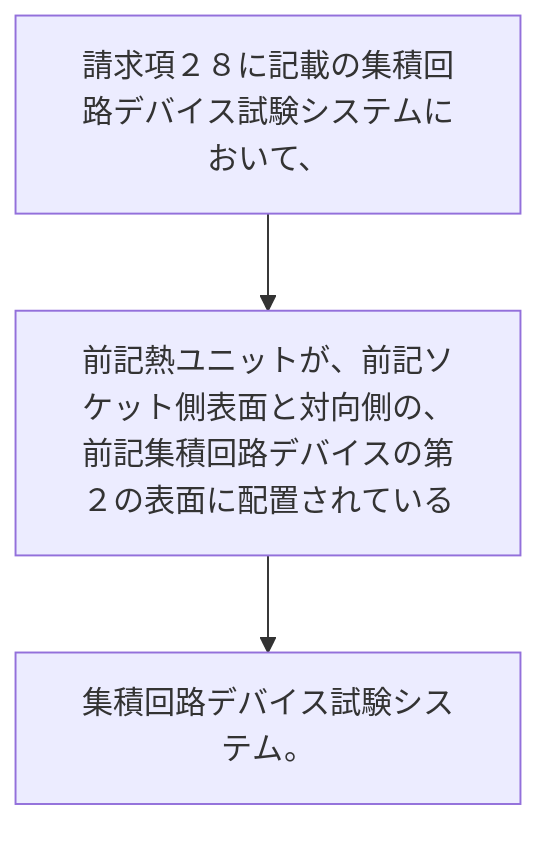

請求項２８に記載の集積回路デバイス試験システムにおいて、
前記熱ユニットが、前記ソケット側表面と対向側の、前記集積回路デバイスの第２の表面に配置されている集積回路デバイス試験システム。

```mermaid
flowchart TD
A[請求項２８に記載の集積回路デバイス試験システムにおいて、]
B[前記熱ユニットが、前記ソケット側表面と対向側の、前記集積回路デバイスの第２の表面に配置されている]
C[集積回路デバイス試験システム。]
A --> B
B --> C
```