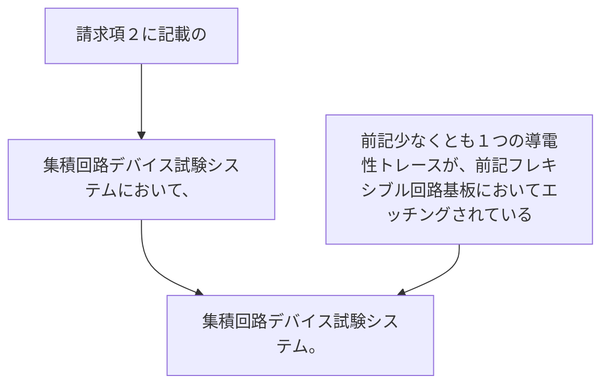

請求項２に記載の集積回路デバイス試験システムにおいて、
前記少なくとも１つの導電性トレースが、前記フレキシブル回路基板においてエッチングされている集積回路デバイス試験システム。

```mermaid
flowchart TD
A[請求項２に記載の]
B[集積回路デバイス試験システムにおいて、]
C[前記少なくとも１つの導電性トレースが、前記フレキシブル回路基板においてエッチングされている]
D[集積回路デバイス試験システム。]
A --> B
B --> D
C --> D
```