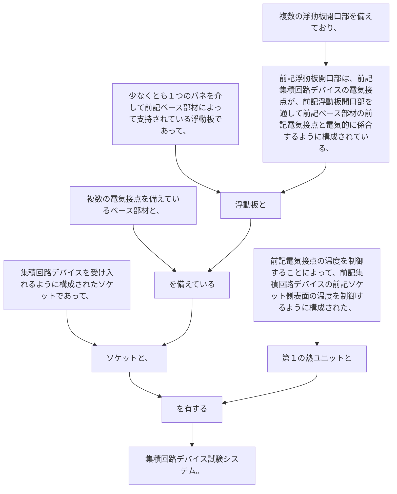

```mermaid
flowchart TD
A[集積回路デバイスを受け入れるように構成されたソケットであって、]
B[複数の電気接点を備えているベース部材と、]
C[少なくとも１つのバネを介して前記ベース部材によって支持されている浮動板であって、]
D[複数の浮動板開口部を備えており、]
E[前記浮動板開口部は、前記集積回路デバイスの電気接点が、前記浮動板開口部を通して前記ベース部材の前記電気接点と電気的に係合するように構成されている、]
F[浮動板と]
G[を備えている]
H[ソケットと、]
I[前記電気接点の温度を制御することによって、前記集積回路デバイスの前記ソケット側表面の温度を制御するように構成された、]
J[第１の熱ユニットと]
K[を有する]
L[集積回路デバイス試験システム。]
A --> H
B --> G
C --> F
D --> E
E --> F
F --> G
G --> H
H --> K
I --> J
J --> K
K --> L
```