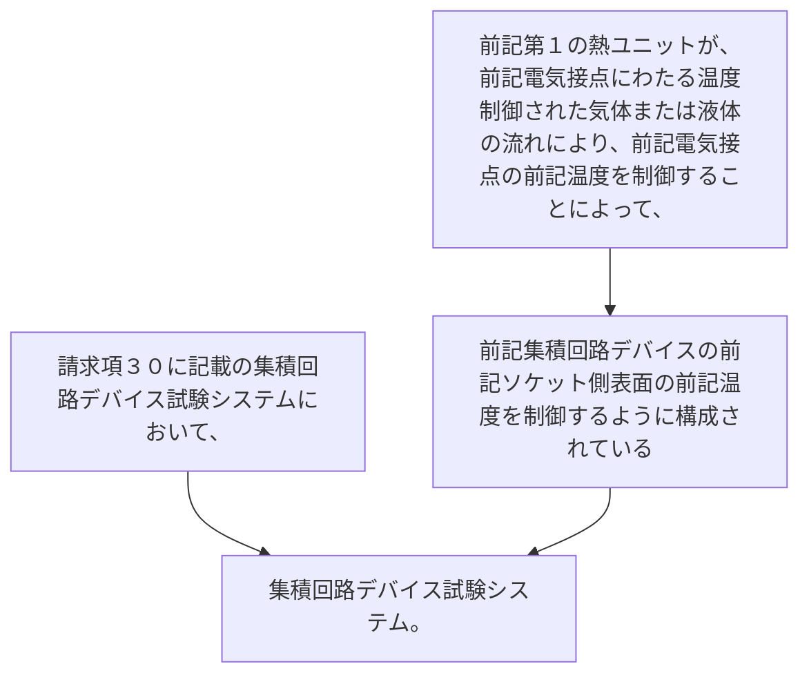

```mermaid
flowchart TD
A[請求項３０に記載の集積回路デバイス試験システムにおいて、]
B[前記第１の熱ユニットが、前記電気接点にわたる温度制御された気体または液体の流れにより、前記電気接点の前記温度を制御することによって、]
C[前記集積回路デバイスの前記ソケット側表面の前記温度を制御するように構成されている]
D[集積回路デバイス試験システム。]
A --> D
B --> C
C --> D
```