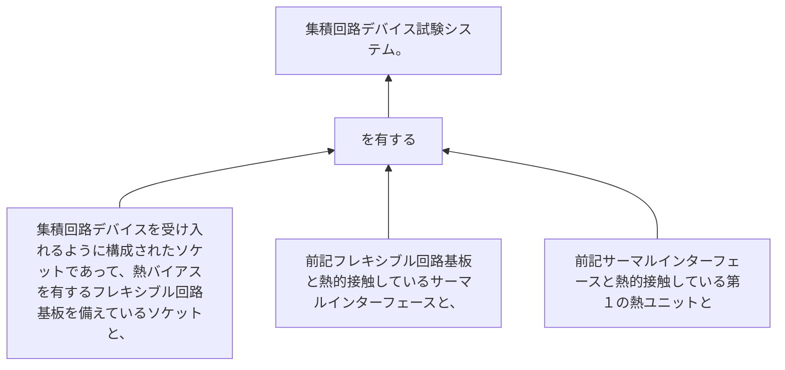

集積回路デバイスを受け入れるように構成されたソケットであって、熱バイアスを有するフレキシブル回路基板を備えているソケットと、
前記フレキシブル回路基板と熱的接触しているサーマルインターフェースと、
前記サーマルインターフェースと熱的接触している第１の熱ユニットとを有する集積回路デバイス試験システム。

```mermaid
flowchart BT
E[集積回路デバイス試験システム。]
D[を有する]
C[前記サーマルインターフェースと熱的接触している第１の熱ユニットと]
B[前記フレキシブル回路基板と熱的接触しているサーマルインターフェースと、]
A[集積回路デバイスを受け入れるように構成されたソケットであって、熱バイアスを有するフレキシブル回路基板を備えているソケットと、]
D --> E
A --> D
B --> D
C --> D
```