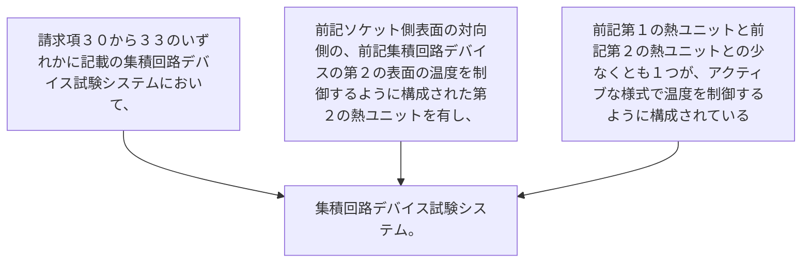

```mermaid
flowchart TD
A[請求項３０から３３のいずれかに記載の集積回路デバイス試験システムにおいて、]
B[前記ソケット側表面の対向側の、前記集積回路デバイスの第２の表面の温度を制御するように構成された第２の熱ユニットを有し、]
C[前記第１の熱ユニットと前記第２の熱ユニットとの少なくとも１つが、アクティブな様式で温度を制御するように構成されている]
D[集積回路デバイス試験システム。]
A --> D
B --> D
C --> D
```