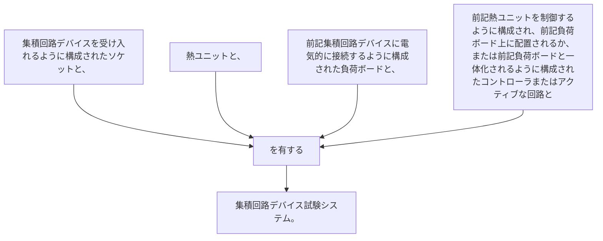

```mermaid
flowchart TD
A[集積回路デバイスを受け入れるように構成されたソケットと、]
B[熱ユニットと、]
C[前記集積回路デバイスに電気的に接続するように構成された負荷ボードと、]
D[前記熱ユニットを制御するように構成され、前記負荷ボード上に配置されるか、または前記負荷ボードと一体化されるように構成されたコントローラまたはアクティブな回路と]
E[を有する]
F[集積回路デバイス試験システム。]
A --> E
B --> E
C --> E
D --> E
E --> F
```