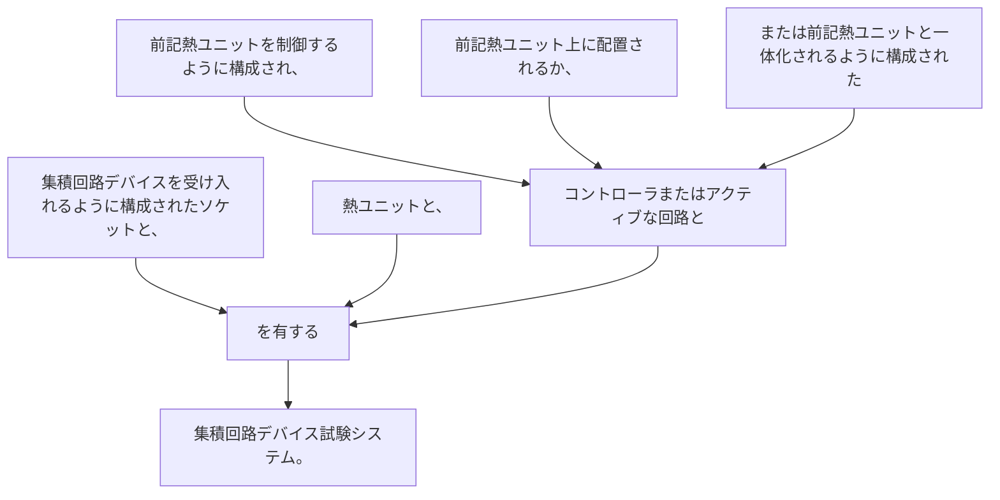

集積回路デバイスを受け入れるように構成されたソケットと、
熱ユニットと、
前記熱ユニットを制御するように構成され、前記熱ユニット上に配置されるか、または前記熱ユニットと一体化されるように構成されたコントローラまたはアクティブな回路とを有する集積回路デバイス試験システム。

```mermaid
flowchart TD
A[集積回路デバイスを受け入れるように構成されたソケットと、]
B[熱ユニットと、]
C[前記熱ユニットを制御するように構成され、]
D[前記熱ユニット上に配置されるか、]
E[または前記熱ユニットと一体化されるように構成された]
F[コントローラまたはアクティブな回路と]
G[を有する]
H[集積回路デバイス試験システム。]
A --> G
B --> G
C --> F
D --> F
E --> F
F --> G
G --> H
```