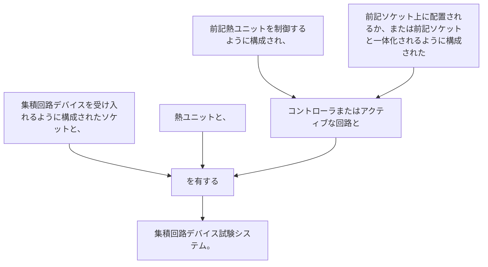

```mermaid
flowchart TD
A[集積回路デバイスを受け入れるように構成されたソケットと、]
B[熱ユニットと、]
C[前記熱ユニットを制御するように構成され、]
D[前記ソケット上に配置されるか、または前記ソケットと一体化されるように構成された]
E[コントローラまたはアクティブな回路と]
F[を有する]
G[集積回路デバイス試験システム。]
A --> F
B --> F
C --> E
D --> E
E --> F
F --> G
```