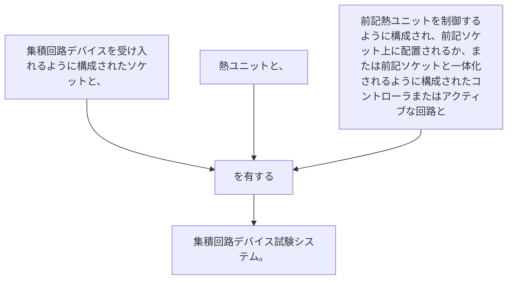

```mermaid
flowchart TD
A[集積回路デバイスを受け入れるように構成されたソケットと、]
B[熱ユニットと、]
C[前記熱ユニットを制御するように構成され、前記ソケット上に配置されるか、または前記ソケットと一体化されるように構成されたコントローラまたはアクティブな回路と]
D[を有する]
E[集積回路デバイス試験システム。]
A --> D
B --> D
C --> D
D --> E
```