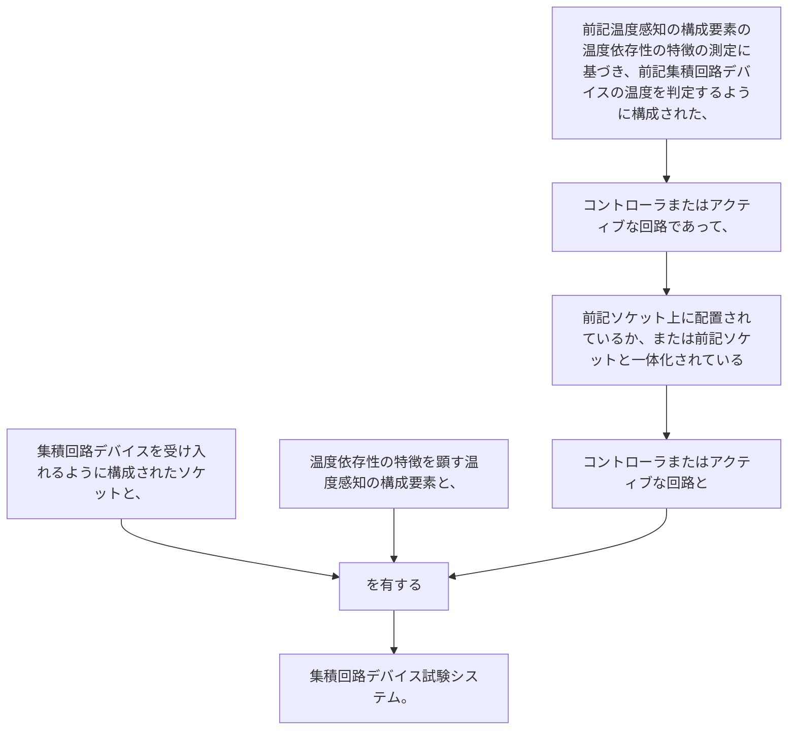

```mermaid
flowchart TD
A[集積回路デバイスを受け入れるように構成されたソケットと、]
B[温度依存性の特徴を顕す温度感知の構成要素と、]
C[前記温度感知の構成要素の温度依存性の特徴の測定に基づき、前記集積回路デバイスの温度を判定するように構成された、]
D[コントローラまたはアクティブな回路であって、]
E[前記ソケット上に配置されているか、または前記ソケットと一体化されている]
F[コントローラまたはアクティブな回路と]
G[を有する]
H[集積回路デバイス試験システム。]
A --> G
B --> G
C --> D
D --> E
E --> F
F --> G
G --> H
```