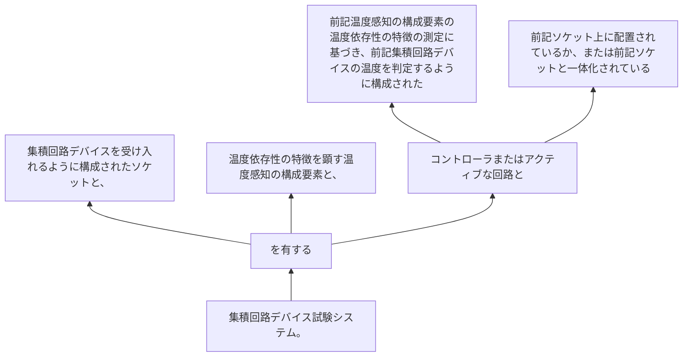

```mermaid
flowchart BT
G[集積回路デバイス試験システム。]
F[を有する]
A[集積回路デバイスを受け入れるように構成されたソケットと、]
B[温度依存性の特徴を顕す温度感知の構成要素と、]
E[コントローラまたはアクティブな回路と]
C[前記温度感知の構成要素の温度依存性の特徴の測定に基づき、前記集積回路デバイスの温度を判定するように構成された]
D[前記ソケット上に配置されているか、または前記ソケットと一体化されている]

G --> F
F --> A
F --> B
F --> E
E --> C
E --> D
```