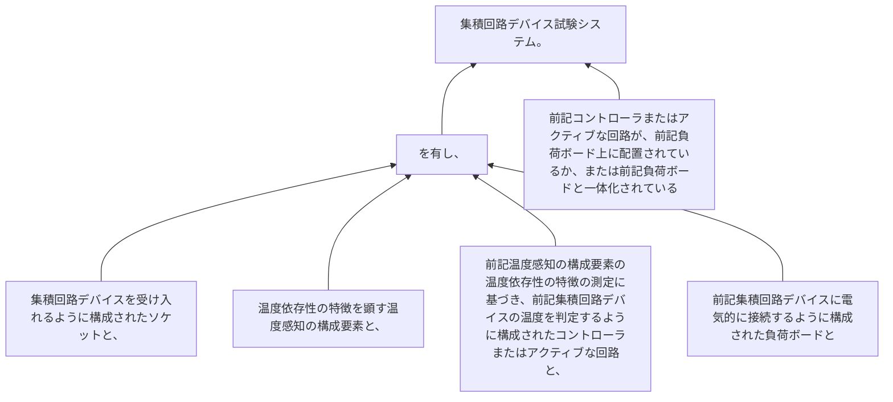

集積回路デバイスを受け入れるように構成されたソケットと、
温度依存性の特徴を顕す温度感知の構成要素と、
前記温度感知の構成要素の温度依存性の特徴の測定に基づき、前記集積回路デバイスの温度を判定するように構成されたコントローラまたはアクティブな回路と、
前記集積回路デバイスに電気的に接続するように構成された負荷ボードとを有し、
前記コントローラまたはアクティブな回路が、前記負荷ボード上に配置されているか、または前記負荷ボードと一体化されている集積回路デバイス試験システム。
