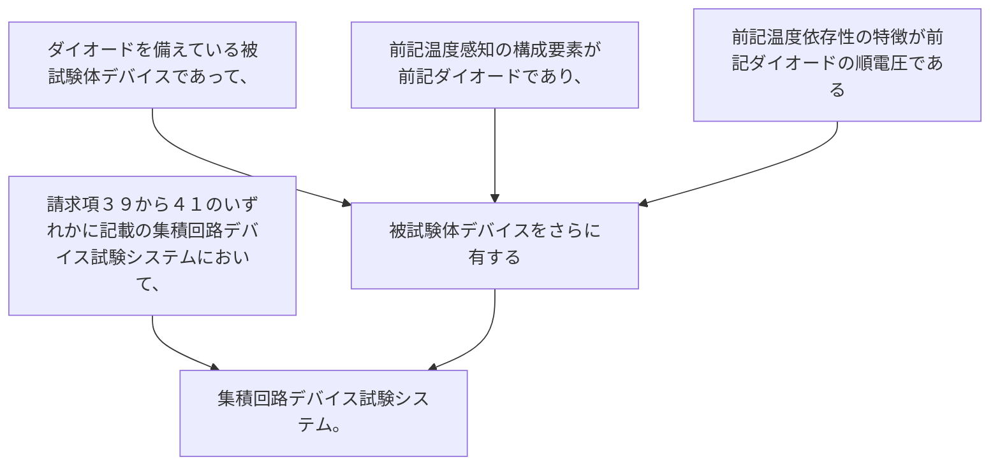

請求項３９から４１のいずれかに記載の集積回路デバイス試験システムにおいて、
ダイオードを備えている被試験体デバイスであって、前記温度感知の構成要素が前記ダイオードであり、前記温度依存性の特徴が前記ダイオードの順電圧である被試験体デバイ
スをさらに有する集積回路デバイス試験システム。

```mermaid
flowchart TD
A[請求項３９から４１のいずれかに記載の集積回路デバイス試験システムにおいて、]
B[ダイオードを備えている被試験体デバイスであって、]
C[前記温度感知の構成要素が前記ダイオードであり、]
D[前記温度依存性の特徴が前記ダイオードの順電圧である]
E[被試験体デバイスをさらに有する]
F[集積回路デバイス試験システム。]
A --> F
B --> E
C --> E
D --> E
E --> F
```