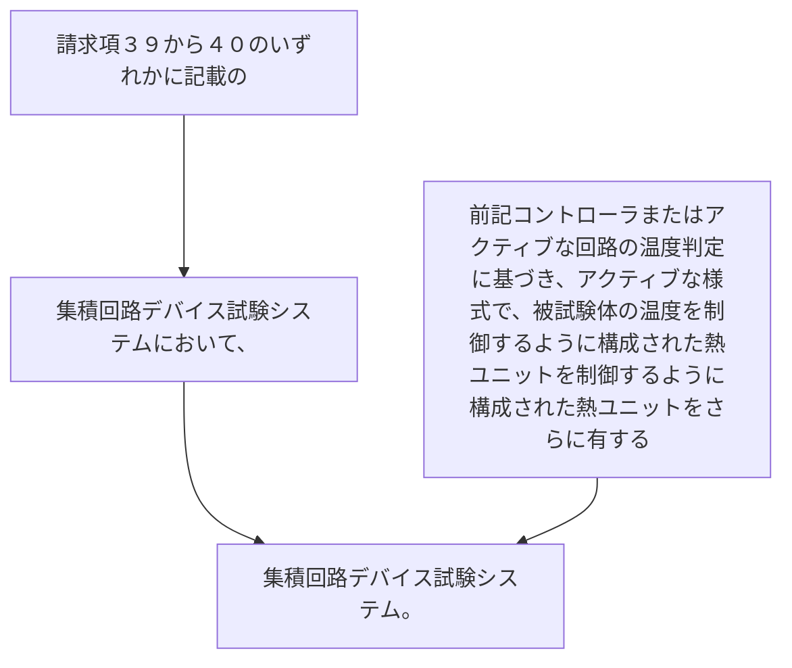

```mermaid
flowchart TD
A[請求項３９から４０のいずれかに記載の]
B[集積回路デバイス試験システムにおいて、]
C[前記コントローラまたはアクティブな回路の温度判定に基づき、アクティブな様式で、被試験体の温度を制御するように構成された熱ユニットを制御するように構成された熱ユニットをさらに有する]
D[集積回路デバイス試験システム。]
A --> B
B --> D
C --> D
```