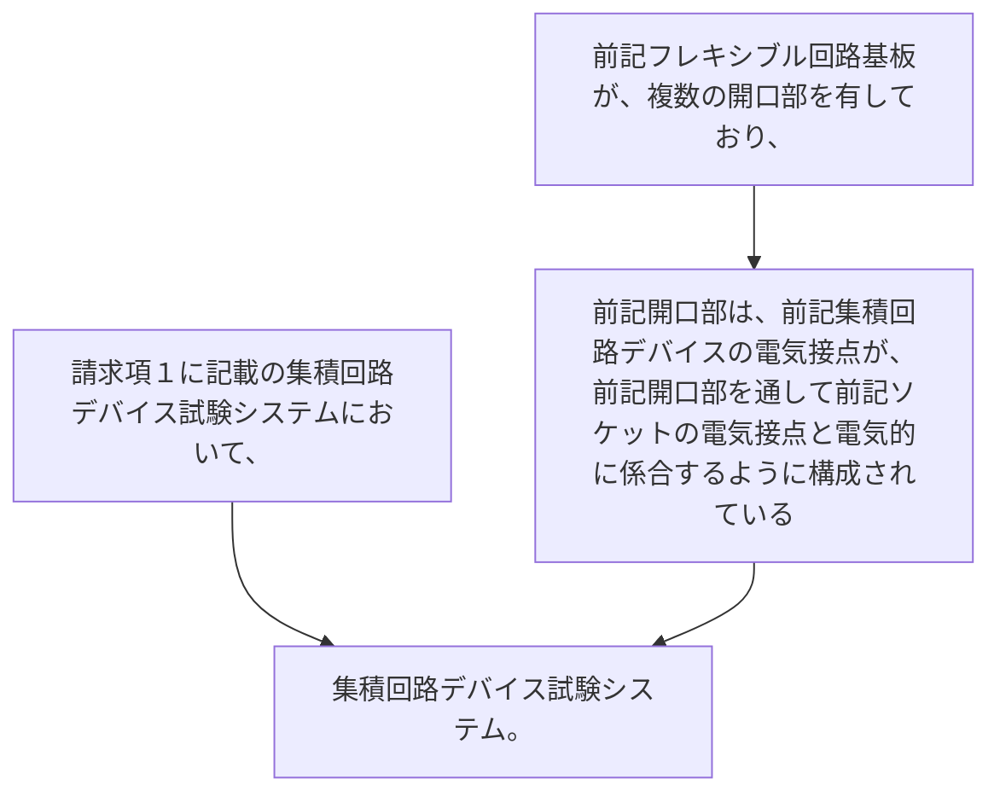

```mermaid
flowchart TD
A[請求項１に記載の集積回路デバイス試験システムにおいて、]
B[前記フレキシブル回路基板が、複数の開口部を有しており、]
C[前記開口部は、前記集積回路デバイスの電気接点が、前記開口部を通して前記ソケットの電気接点と電気的に係合するように構成されている]
D[集積回路デバイス試験システム。]
A --> D
B --> C
C --> D
```