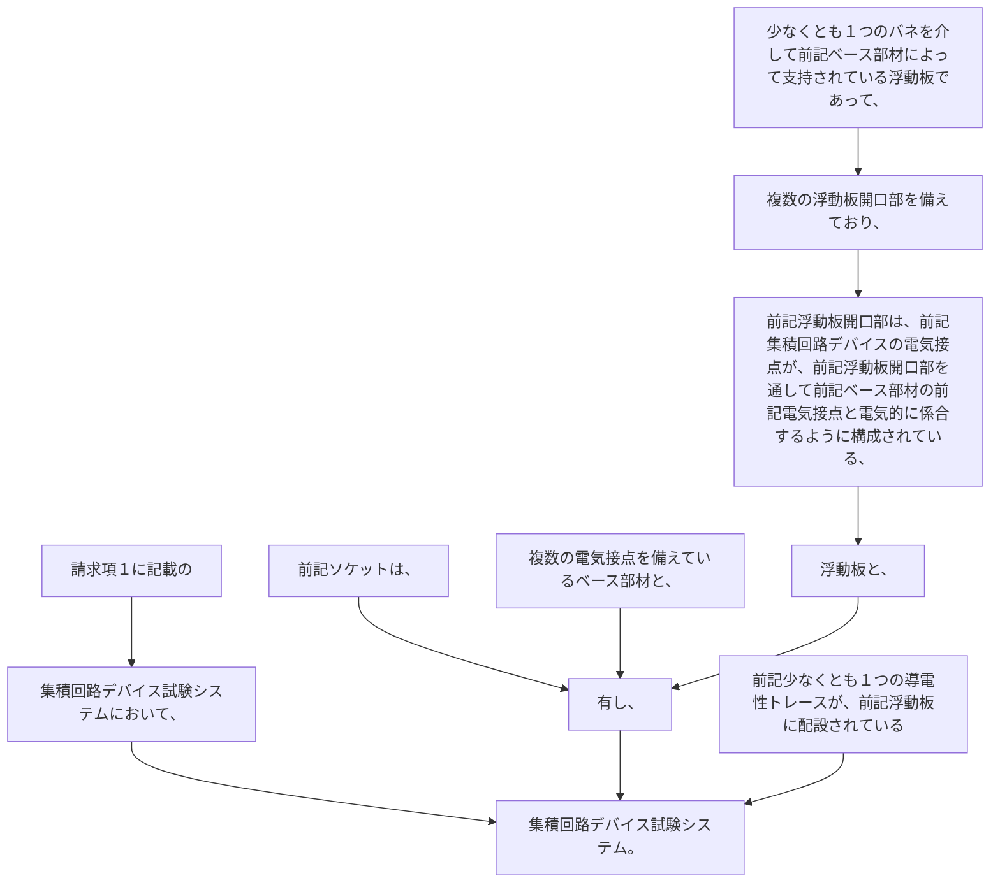

請求項１に記載の集積回路デバイス試験システムにおいて、
前記ソケットは、
複数の電気接点を備えているベース部材と、
少なくとも１つのバネを介して前記ベース部材によって支持されている浮動板であって、複数の浮動板開口部を備えており、前記浮動板開口部は、前記集積回路デバイスの電気接点が、前記浮動板開口部を通して前記ベース部材の前記電気接点と電気的に係合するように構成されている、浮動板と、
を有し、
前記少なくとも１つの導電性トレースが、前記浮動板に配設されている集積回路デバイス試験システム。
