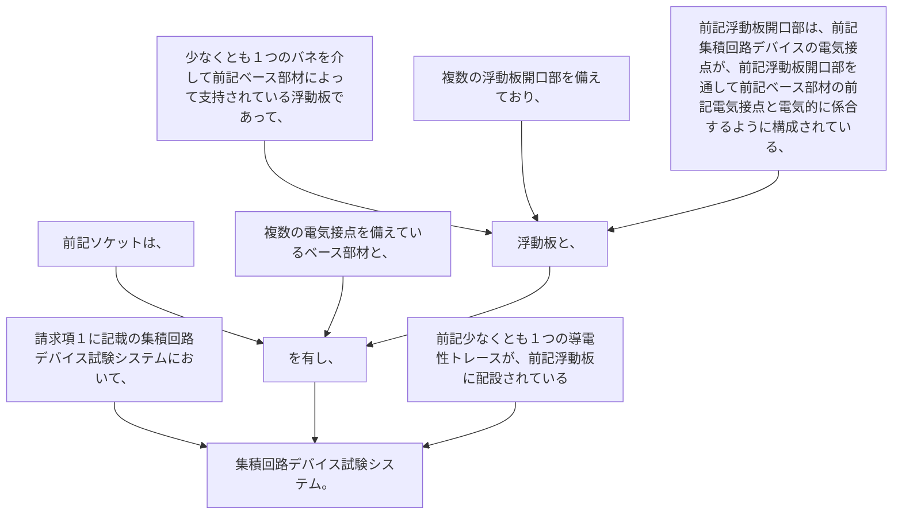

```mermaid
flowchart TD
A[請求項１に記載の集積回路デバイス試験システムにおいて、]
B[前記ソケットは、]
C[複数の電気接点を備えているベース部材と、]
D[少なくとも１つのバネを介して前記ベース部材によって支持されている浮動板であって、]
E[複数の浮動板開口部を備えており、]
F[前記浮動板開口部は、前記集積回路デバイスの電気接点が、前記浮動板開口部を通して前記ベース部材の前記電気接点と電気的に係合するように構成されている、]
G[浮動板と、]
H[を有し、]
I[前記少なくとも１つの導電性トレースが、前記浮動板に配設されている]
J[集積回路デバイス試験システム。]

A --> J
B --> H
C --> H
D --> G
E --> G
F --> G
G --> H
H --> J
I --> J
```