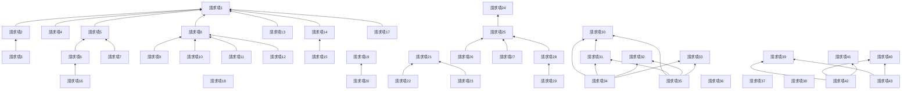

```mermaid
flowchart BT
A[請求項1]
B[請求項2]
C[請求項3]
D[請求項4]
E[請求項5]
F[請求項6]
G[請求項7]
H[請求項8]
I[請求項9]
J[請求項10]
K[請求項11]
L[請求項12]
M[請求項13]
N[請求項14]
O[請求項15]
P[請求項16]
Q[請求項17]
R[請求項18]
S[請求項19]
T[請求項20]
U[請求項21]
V[請求項22]
W[請求項23]
X[請求項24]
Y[請求項25]
Z[請求項26]
AA[請求項27]
BB[請求項28]
CC[請求項29]
DD[請求項30]
EE[請求項31]
FF[請求項32]
GG[請求項33]
HH[請求項34]
II[請求項35]
JJ[請求項36]
KK[請求項37]
LL[請求項38]
MM[請求項39]
NN[請求項40]
OO[請求項41]
PP[請求項42]
QQ[請求項43]

B --> A
C --> B
D --> A
E --> A
F --> E
G --> E
H --> A
I --> H
J --> H
K --> H
L --> H
M --> A
N --> A
O --> N
P --> F
Q --> A
T --> S
V --> U
W --> U
Y --> X
Z --> Y
AA --> Y
BB --> Y
CC --> BB
EE --> DD
HH --> DD
HH --> EE
HH --> FF
HH --> GG
II --> DD
II --> EE
II --> FF
II --> GG
PP --> MM
PP --> NN
PP --> OO
QQ --> MM
QQ --> NN
```
